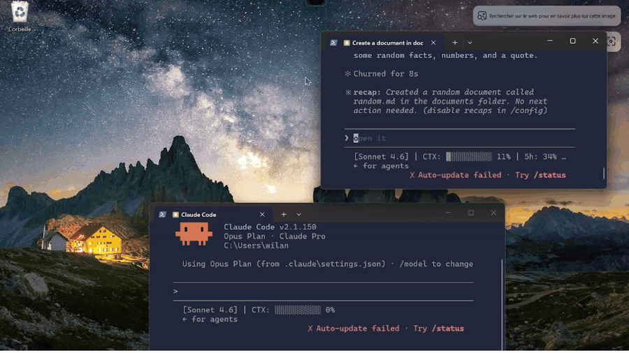
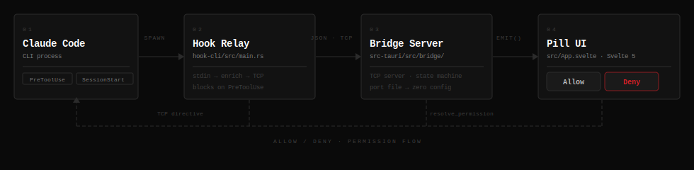

# Claude Island

> Manage all your Claude Code sessions in one place — tap Allow or Deny when one asks for permission.



A floating pill at the top of your screen. Shows every Claude Code session you've got running, what they're up to, and lets you Allow/Deny tool calls without leaving your current window.

A floating pill that lives quietly at the top of your screen and lights up when an agent needs your attention.

---



---

## What it does

- **One pill, all your agents.** See every active Claude Code session at a glance.
- **Approval, without the context switch.** Bash / Edit / Write prompts show up in the pill — click Allow or Deny. Done.
- **Stays out of the way.** Sits as a 14px sliver at the top of the screen until something needs you, then expands.
- **Click a session → focus its terminal.** No more hunting through ten Windows Terminal tabs to find the one asking a question.

---

## Install

### Windows

```powershell
git clone https://github.com/william-bossut/open-island-linux
cd open-island-linux
pnpm install
cargo tauri dev    # dev — hot reload
cargo tauri build  # release build
```

Requirements: Rust, Node 20+, pnpm, WebView2 (ships with Windows 11).

<details>
<summary>Linux (works, less actively maintained)</summary>

Requires KDE Plasma (Wayland via XWayland, or X11), plus WebKit2GTK deps:

```bash
# Fedora
sudo dnf install webkit2gtk4.1-devel openssl-devel libappindicator-gtk3-devel \
  librsvg2-devel pango-devel cairo-devel gdk-pixbuf2-devel gtk3-devel

# Ubuntu
sudo apt install libwebkit2gtk-4.1-dev libssl-dev libappindicator3-dev \
  librsvg2-dev libpango1.0-dev libcairo2-dev libgdk-pixbuf2.0-dev libgtk-3-dev
```

Then the same `cargo tauri dev` / `cargo tauri build`.

</details>

---

## Setup

1. Launch the app — pill appears at the top of the screen, tray icon in the corner.
2. Hooks auto-install on first launch. Nothing to configure.
3. Start a Claude Code session anywhere. It shows up in the pill within a second.

To remove hooks: tray → **Uninstall Hooks & Quit**. Plain "Quit" leaves hooks in place.

---

## How it works

Claude Code fires hooks (`PreToolUse`, `SessionStart`, etc.) → a tiny relay binary forwards them over a local TCP socket → the Tauri app updates the pill and, for gated tools, blocks the hook until you click Allow or Deny. The relay writes the decision back to Claude Code's stdout.

The pill is synchronous with your agent. Click matters.

---

## Tools that ask before running

`Bash` · `Edit` · `Write` · `MultiEdit` · `NotebookEdit` · `WebFetch` · `WebSearch` · `computer_use`

Edit `requires_approval()` in `src-tauri/src/bridge/server.rs` to change the list.

---

## Credits

Inspired by [open-vibe-island](https://github.com/steipete/open-vibe-island) (macOS) by [@steipete](https://github.com/steipete). Built with [Tauri](https://tauri.app), [Svelte 5](https://svelte.dev), and [Claude Code](https://claude.ai/code).

## License

MIT
